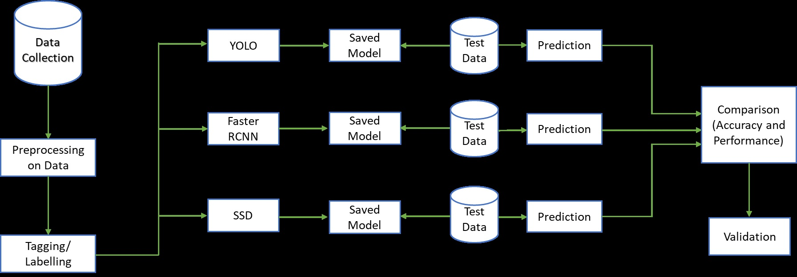

# Gooseberries-Detection-and-Yield-Estimation-Proposal

## Introduction:
Conventional methods of monitoring for agriculture are time consuming. Many artificial companies are making intelligent systems that can detect, analyze and monitor field of various data to study the status and feasibility of growing certain types of crops. Machine learning can help farmers to predict crop quality, yield estimation and disease detection. Object detection is the fundamental problem in computer vision and active research for several years. The main purpose of object detection is to find an instance from an images and videos. There are different categories of instance, which can be detected (e.g. human, cat, dog, cycle etc...) on some location (via a bounding box). Many high-level vision task are also solvable using object detection like segmentation, activity recognition and event capturing. Object detection has many applications in area of artificial intelligence and computer vision including robot vision and precision farming. For Gooseberries detection, first we annotate the dataset and will use this dataset for training. After this, we perform testing of on real time images to detect the gooseberries and calculate its yield estimation. We will use open source labelling tool for annotations. For detection, we will use Faster RCNN, SSD and YOLO object detection Models.

## Literature Review
Zeeshan et al. present a technique to estimate citrus fruit yield from the tree images. Manually counting the fruit for yield estimation for marketing and other managerial tasks is time consuming and requires human resources, which do not always come cheap. Different approaches have been used for the said purpose, yet separation of fruit from its background poses challenges, and renders the exercise inaccurate. In this paper, we use k-means segmentation for recognition of fruit, which segments the image accurately thus enabling more accurate yield estimation. We created a dataset containing 83 tree images with 4001 citrus fruits from three different fields. We are able to detect the on-tree fruits with an accuracy of 91.3%.
Suchet Bargoti et al. presents an image-processing framework for fruit detection and counting using orchard image data. A general-purpose image segmentation approach is used, including two feature learning algorithms; multi-scale Multi-Layered Perceptrons (MLP) and Convolutional Neural Networks (CNN). These networks were extended by including contextual information about how the image data was captured (metadata), which correlates with some of the appearance variations and/or class distributions observed in the data. The pixel-wise fruit segmentation output is processed using the Watershed Segmentation (WS) and Circular Hough Transform (CHT) algorithms to detect and count individual fruits. Experiments were conducted in a commercial apple orchard near Melbourne, Australia. The results show an improvement in fruit segmentation performance with the inclusion of metadata on the previously benchmarked
MLP network. We extend this work with CNNs, bringing agrovision closer to the state-of-the-art in computer vision, where although metadata had negligible influence, the best pixel-wise F1-score of 0.791 was achieved. The WS algorithm produced the best apple detection and counting results, with a detection F1-score of 0.858.

## Methodology

First, we collect data of gooseberries and will perform tagging on this dataset. After that, we use this dataset as input of models for detection and yield estimation.

## Bene00000000000fits
It is anticipated that the work of such automated systems will be built on the processing of hyperspectral images and 3D laser scanning, which will significantly increase the accuracy and amount of data collected. It is noteworthy to comment that such technologies would help many farmers to produce accurate diagnostics of individual areas or even individual plants growing on the field, thus controlling their harvest and it’s potential. Right now Machine Learning can help farmers to predict yield and crop quality, detect weed and disease:
### Yield prediction: 
new cutting-edge approaches have gone far beyond simple prediction based on the historical data, but incorporate computer vision technologies to provide data on the go and comprehensive multidimensional analysis of crops, weather, and economic conditions.

### Crop Quality: 
in comparison with human experts, machines can make use of seemingly meaningless data and interconnections to reveal new qualities playing role in the overall quality of the crops and to detect them.

### Disease Detection: 
ML is used as a part of the general precision agriculture management, where agro-chemicals input is targeted in terms of time, place and affected plants.
### Weed Detection: 
Computer vision and ML algorithms can improve detection and discrimination of weeds at low cost and with no environmental issues and side effects. In the future, these technologies will drive robots that will destroy weeds, minimizing the need for herbicides.
Precision Agriculture
The practice, known as “precision (precision) farming,” uses real-time and historical data along with machine learning algorithms to make specific decisions for small areas of the application, rather than performing the same task for a very large area in the traditional model. For example, instead of applying large quantities of pesticides to a wide area, you can apply smaller amounts to specific trees, shrubs, or even leaves, reducing costs and waste, while avoiding damage that a chemical can cause when used in bulk order.

An example of precision farming is Prospera, a company that wants to turn agriculture into data-based practices. Prospera uses field video cameras, sensors, and micro-meteorological data to monitor and provide crop information in real time. Algorithms for deep learning and computer vision analyze the data collected to find out and report when something important is happening. This helps in a number of initiatives, such as finding and eliminating early signs of disease, to prevent damage and increase yields. One of the advantages of using computer vision for image analysis is that, if AI is well trained, algorithms can often see things that go unnoticed by the human eye, even by trained experts. A similar approach is used in medicine to diagnose cancer
